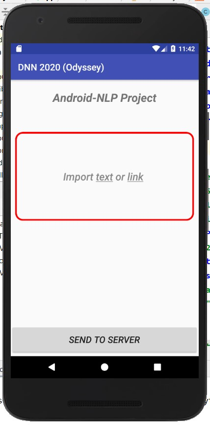
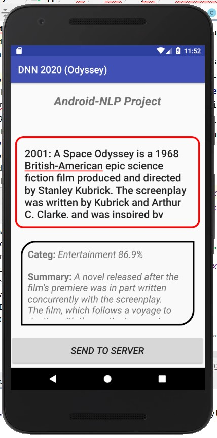

# NLP-Android App

This Application concerns the development of an Android interface, which in sync with a python server, is able able to categorize natural text in different classes. 
For categorization are used [LSTM](https://en.wikipedia.org/wiki/Long_short-term_memory)  and [GRU](https://en.wikipedia.org/wiki/Gated_recurrent_unit) rnn models.  
The project consist of:
* A [client–server model](https://en.wikipedia.org/wiki/Client%E2%80%93server_model) (android interface/python sever).
* and a Recurrent Neural Network ([RNN](https://en.wikipedia.org/wiki/Recurrent_neural_network)) sequential model.

The above work is part of the final project for the MSc course in deep neural networks ([DSIT](http://dsit.di.uoa.gr/)).

***
  

> ***Android Interface***
 

 
 <table  >
   <tr >
    <th>Prompt Message</th>
    <th>Reply</th>
  </tr>
  <tr >
    <td></td>
    <td></td>
  </tr>

</table> 

***
