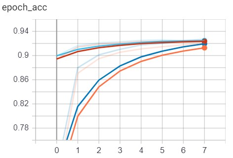
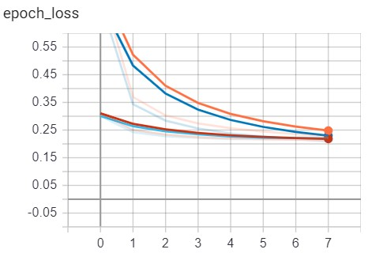

# NLP-Android App

This Application concerns the development of an Android interface, which in sync with a python server, is able able to categorize natural text in different classes. 
For categorization are used [LSTM](https://en.wikipedia.org/wiki/Long_short-term_memory)  and [GRU](https://en.wikipedia.org/wiki/Gated_recurrent_unit) rnn models. 
> The project consist of:
> * A [client–server model](https://en.wikipedia.org/wiki/Client%E2%80%93server_model) (android interface/python sever).
> * The Recurrent Neural Networks ([RNNs](https://en.wikipedia.org/wiki/Recurrent_neural_network)) sequential models.
>
> The above work is part of the final project for the MSc course in deep neural networks ([DSIT](http://dsit.di.uoa.gr/)).

***

 

## **Client–Server model**

 

The user uses the app to pass the text data to the device and sends the input to the server throw a socket channel.   After, the server has to reify two separate tasks:

1. Detect the most significant sentences on the text based on the [Term frequency](https://www.opinosis-analytics.com/knowledge-base/term-frequency-explained/#.X3DU7u1S_BV) scores. 
2. Runs a rnn model to classify the input text to business, medicine, science or entertainment category.

Subsequently, The server sends a response to the client, and the connection is terminated. The final output is displayed to the user. 

 
 <table  >
   <tr >
    <th>Prompt Message</th>
    <th>Reply</th>
  </tr>
  <tr >
    <td></td>
    <td></td>
  </tr>

</table> 

***

 

## **RNN models**
The performace of the LSTM and GRU models is presented on the following diagrams: 

<table style="width:100%">
<tr>
   <th  colspan="2">   &nbsp;&nbsp;&nbsp;&nbsp; LSTM(Blue) &nbsp;&nbsp; | &nbsp;&nbsp; GRU(Orange) </th>
</tr>   
  <tr>  <th>Accuracy</th> <th>Loss</th>   </tr>
<tr>
   <td></td>
   <td></td>
</tr>
</table>

 

<table style="width:100%">
<tr> <th  colspan="2">  Confusion Matrix </th> </tr>   
  <tr>  <th>LSTM</th> <th>GRU</th>   </tr>
<tr>
   <td>
 
 <table>
  <thead>
    <tr>
     <th> </th> <th>Entertain.</th>  <th>Buisiness</th>  <th>Science</th> <th>Medicine</th>
    </tr>
  </thead>
  <tbody>
    <tr>
     <th>Entertain.</th> <td>12055</td> <td>192</td> <td>182</td> <td>195</td>
    </tr>
    <tr>
      <th>Buisiness</th> <td>230</td> <td>11278</td> <td>773</td> <td>301</td>
    </tr>
   <tr>
      <th>Science</th> <td>251</td> <td>760</td> <td>11100</td> <td>206</td>
    </tr>
    <tr>
      <th>Medicine</th> <td>180</td> <td>281</td> <td>127</td> <td>10799</td>
    </tr>
</table> 
   </td>

   <td>  
 <table>
  <thead>
    <tr>
     <th> </th> <th>Entertain.</th>  <th>Buisiness</th>  <th>Science</th> <th>Medicine</th>
    </tr>
  </thead>
  <tbody>
    <tr>
     <th>Entertain.</th> <td>11998</td> <td>228</td> <td>228</td> <td>170</td>
    </tr>
    <tr>
      <th>Buisiness</th> <td>218</td> <td>11287</td> <td>808</td> <td>269</td>
    </tr>
   <tr>
      <th>Science</th> <td>201</td> <td>724</td> <td>11206</td> <td>186</td>
    </tr>
    <tr>
      <th>Medicine</th> <td>193</td> <td>307</td> <td>189</td> <td>10698</td>
    </tr>
</table>
  </td>
</tr>
</table>

